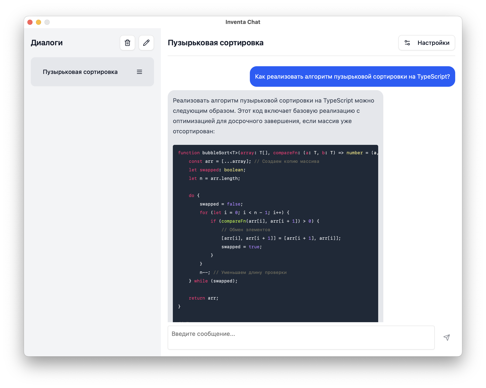

# Inventa Chat - Кроссплатформенный чат с OpenAI API


**Inventa Chat** - кроссплатформенное чат-приложение с поддержкой OpenAI API, созданное для изучения Vue3. Приложение позволяет взаимодействовать с различными LLM-моделями через единый интерфейс.



## ✨ Особенности
- Полная совместимость с OpenAI API
- Кроссплатформенная работа (Windows/macOS/Linux)
- Современный адаптивный интерфейс
- Темная/светлая темы
- Локальное сохранение истории чатов
- Быстрые ответы через стриминг

## 🛠 Технологии
- **Frontend**: 
  
  
  
  
- **Backend/Build**: 
  

## 🚀 Запуск проекта

### Предварительные требования
- Установленный [Go](https://go.dev)
- [Node.js](https://nodejs.org)
- [Wails CLI](https://wails.io)

### Сборка и запуск

#### Вариант 1: Полная разработка (с hot-reload)
```bash
wails dev
```

#### Вариант 2: Только фронтенд
```bash
cd frontend
npm install
npm run dev
```

---

Разработано с ❤️ для изучения Vue3 | [AGPLv3 License](LICENSE)
